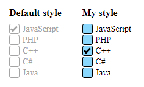

# style CheckBox In JavaScript By Amur

## Documentation

| Props               | Type      | Value              |
| ------------------- | --------- | ------------------ |
| checkboxPosition    | text      | 'right' or 'left'  |
| checkMarkColor      | text      | '#A4A4A4'          |
| boxBorderColor      | text      | '#A4A4A4'          |
| checkBackground     | text      | '#FFFFFF'          |
| label               | boolean   | true or false      |
| labelColor          | text      | '#A4A4A4'          |

## Default Options

    {
        checkboxPosition: 'left',
        checkColor: '#A4A4A4',
        checkBackground: '#FFFFFF',
        label: true,
        labelColor: '#A4A4A4'
    }

## Example

### HTML
#### data-label attribute for create label tag

    <input type="checkbox" class="YOUR-CLASS" data-label="JavaScript" />

### JavaScript

    let input = document.querySelectorAll('.YOUR-CLASS');
    new DesignCheckBox(input).design({
        checkboxPosition: 'left',
        checkMarkColor: '#000000',
        boxBorderColor: '#000000',
        checkBackground: '#8bd8ff',
        label: true,
        labelColor: '#000000'
    });